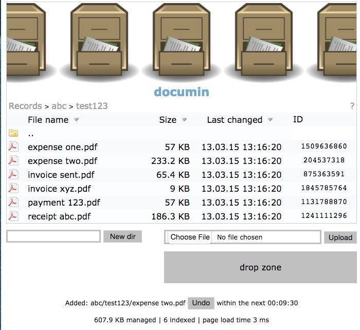

# documin

*documin* is a minimal document management system. It provides a simple means of managing small file archives where files can both be browsed hierarchically by users and referenced by ID via a web interface accessed by external systems. It was originally created to link financial records to an accounting system.

## Requirements

*documin* was created to meet the following requirements:

* Web browser interface to an ordinary file system where file records are archived.
* Write access to the archive file system, via a web browser, in order to add to new files and directories.
    * No ability to modify or delete files - i.e. an "add only" interface.
* Reference files by ID as a query parameter to a simple URL.
* References by ID are unaffected by reorganization of the files (e.g. manually changing the layout of directory tree used to organize the files), moving to a different server, changing the database, restoring the files from a backup, etc.
* Identify archived file duplication.
    * Same file stored in two different places.
    * Both files share the same ID but the system must beware of their differing locations.
* Little to no need to maintain a database, or even be aware of the existence of a database.
* Trivially simple to deploy.
* No need to index the entire file set in order to get started. The system becomes aware of a file the first time it is accessed by the browser.
* Ability to index, or reindex, the entire database.
    * And this is safe - consequence free - operation, other than the time it takes.
* No security implemented by the web interface beyond the write-only interface.
    * Security is left to the underlying web server and file system configuration.

## Anti-Requirements

*documin* is intentionally simple. It was specifically _not_ created to meet the following requirements and likely never will be modified to do so, even though it may be tempting and technically feasible:

* Text search of the indexed files.
   * This is better handled by a dedicated external search system.
   * To integrate with such a system *documin* may expose a list of the files it has under management - that's it.
* File deletion, movement, user security, file admin, etc.
   * *documin* is specifically intended to provide an add-only write interface. A system administrator can do all other necessary management via ordinary file system interfaces.
      * An exception may be implemented to permit users to undo an operation. But it would be limited to a single session and time window.
* No support for file thumbnails, fancy image browsing, icon support of a wide variety of file types (a limited set is okay), any sort of server side image preview generation.

## Getting Started

Configure your web server to expose a file system directory that you want to manage. On a simple linux that may be as simple as creating a directory in /var/www.

Copy documin.php to the root of the managed directory tree. Optionally rename documin.php to index.php. Optionally review and change the configuration settings in documin.php.

## Referencing Files By ID

Use a web browser to visit the directory where documin.php was placed on your server. Browse the directory tree to locate the file to which you want to link. Note the ID field, each ID is a path independent link to the file, e.g.:

    http://my-server/my-documin-files/?fileid=306919836

Note that the above url assumes you have renamed documin.php to index.php. This is not strictly necessary. The *documin* script can have any name you like but if it is not index.php then, of course, you must include that name the url.

The ID that is generated by *documin* is the file's MD5 hash modulo 2^31 represented in decimal. This make it suitable for use by external systems that require a signed 32 bit integer file ID (as is the case for the system with which *documin* had to originally integrate). Note that a *documin* configuration parameter exist that permits use of the full 128 bit hex encoded MD5 value, or a decimal modulo 2^63 value.

## Admin

*documin* has a simple admin interface:

    http://my-server/my-documin-files/?admin

The admin interface provides the ability to delete the document database and to re-index the file system. This is important if the structure of the files has changed. In that case it is necessary to delete the *documin* database and re-index the files.

## Credits

The simple single file structure of documin.php was inspired by, and derived from, [Encode Explorer] (http://encode-explorer.siineiolekala.net). Everything that didn't meet the *documin* requirements was removed from the original Encode Explorer code. New code was added to support file id generation, database management, and file linking by id.

Jim Trainor  
2 June 2014
